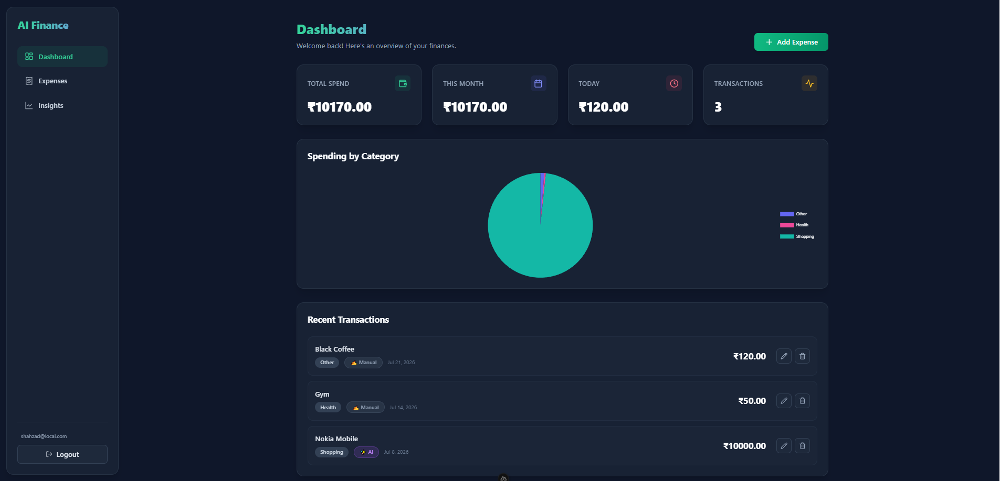
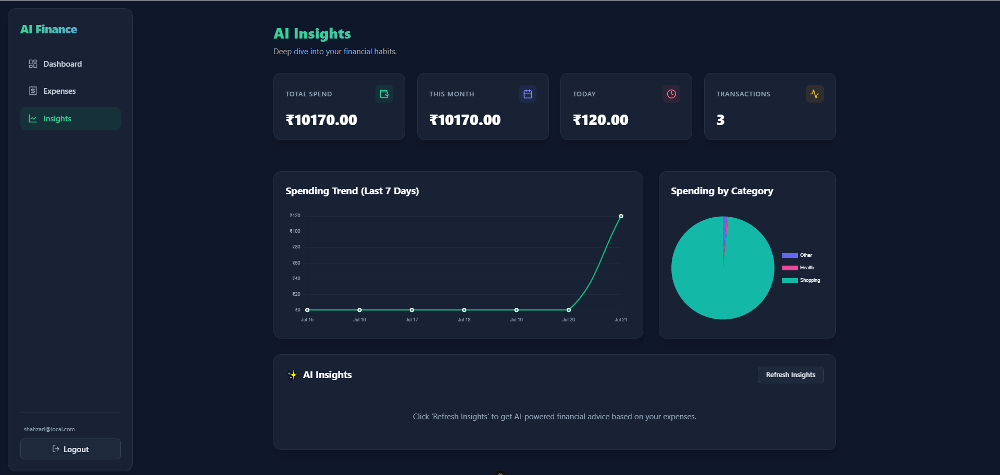
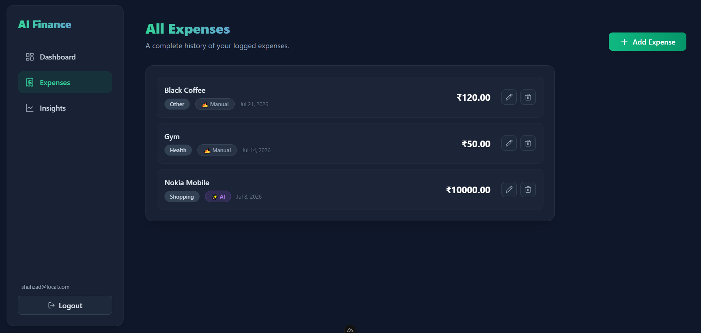

<div align="center">
  
  <h1>AI Finance Tracker</h1>

  <p>
    
    
    
    
    
  </p>

  <p>
    <em>A modern, intelligent personal finance management application featuring AI-driven insights.</em><br/>
    <strong>Built and developed by <a href="https://github.com/ShazCoder84">Shahzad Barkati</a></strong>
  </p>
</div>

<br/>

## Description
AI Finance Tracker is a modern, intelligent personal finance management application built with Nuxt 3. It leverages the power of Google's Gemini AI to provide smart insights into your financial data. The application uses Supabase for a robust backend and real-time database, and Tailwind CSS for a sleek, responsive user interface.

## Features
- **AI-Powered Insights**: Get intelligent analysis and financial advice using Google Gemini AI.
- **Modern UI**: Clean, intuitive, and responsive design built with Tailwind CSS.
- **Data Visualization**: Interactive and insightful charts powered by Chart.js.
- **Secure Data Storage**: Reliable backend and authentication powered by Supabase.

## Screenshots

### Dashboard
*A comprehensive overview of your financial status, featuring clear summaries and interactive charts.*


### AI Insights
*Smart, data-driven analysis of your spending habits and personalized recommendations generated by Gemini AI.*


### Expenses
*A detailed and organized view of all your tracked expenses and financial transactions.*


### Add Expense
*An intuitive and easy-to-use interface for quickly logging your new expenses.*


## Tech Stack
- **Framework**: Nuxt 3 / Vue 3
- **Styling**: Tailwind CSS
- **Backend & Database**: Supabase
- **AI Integration**: Google Gemini API (`@google/genai`)
- **Charts**: Chart.js / vue-chartjs
- **Icons**: Lucide Vue Next

## Prerequisites
Before you begin, ensure you have met the following requirements:
- **Node.js**: v18 or newer recommended.
- **Package Manager**: npm, yarn, pnpm, or bun.
- **Supabase Account**: A Supabase project for the database.
- **Gemini API Key**: A Google Gemini API key for AI features.

## Getting Started

### 1. Clone the repository
```bash
git clone https://github.com/ShazCoder84/ai-finance-tracker.git
cd ai-finance-tracker
```

### 2. Install dependencies
```bash
npm install
# or
yarn install
# or
pnpm install
```

### 3. Environment Variables
Copy the `.env.exmple` file to a new file named `.env` in the root of the project:
```bash
cp .env.exmple .env
```

Open `.env` and fill in your actual credentials:
```env
SUPABASE_URL=your_supabase_project_url
SUPABASE_KEY=your_supabase_anon_key
SUPABASE_DB_PASSWORD=your_supabase_db_password
GEMINI_API_KEY=your_google_gemini_api_key
```

### 4. Run the development server
Start the application in development mode:
```bash
npm run dev
# or
yarn dev
# or
pnpm dev
```
The application will be available at `http://localhost:3000`.

## How to Use
- **Dashboard**: View your overall financial status, summaries, and interactive charts.
- **Manage Transactions**: Log your daily income and expenses accurately.
- **AI Assistant**: Interact with the Gemini AI to analyze your spending patterns, get saving tips, or ask financial questions based on your data.

## Building for Production
To build the application for production deployment, run:
```bash
npm run build
```
You can then preview the production build locally with:
```bash
npm run preview
```

---

<div align="center">
  <p>Built and developed with ❤️ by <strong>Shahzad Barkati</strong></p>
</div>
